# 초보자용 설치 가이드
### 1. Discord 서버 만들기

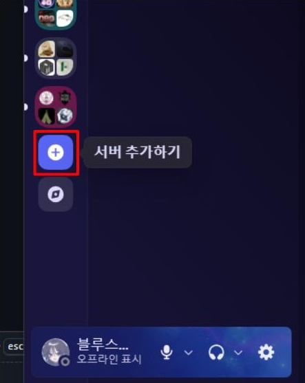

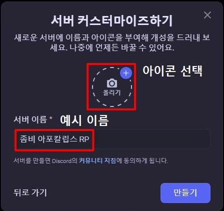

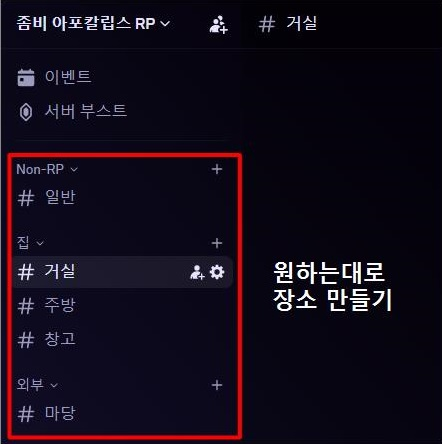

### 2. Discord 봇 만들기

https://discord.com/developers/applications

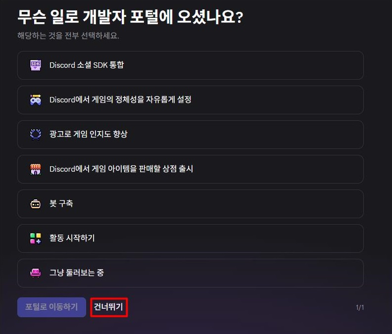

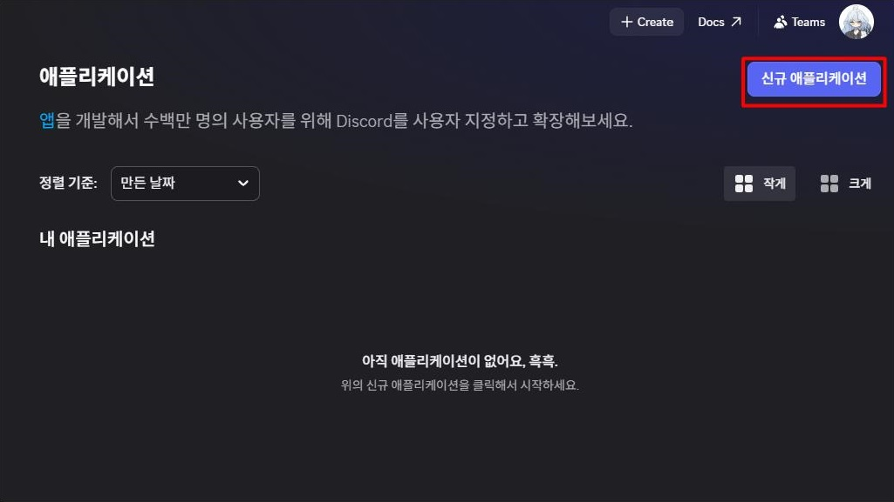

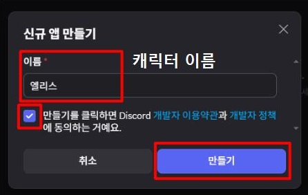

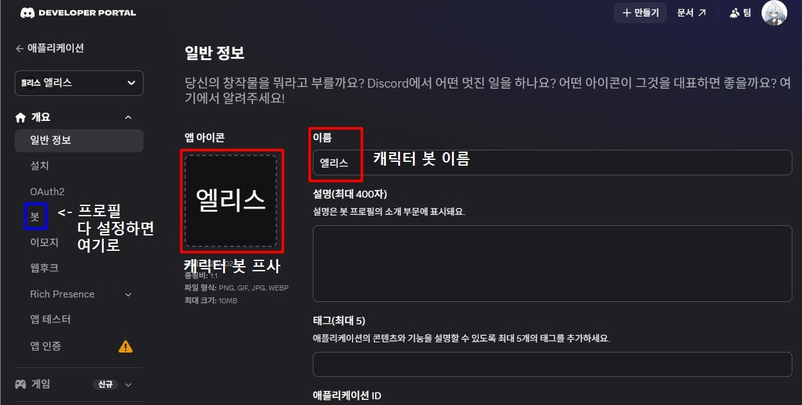

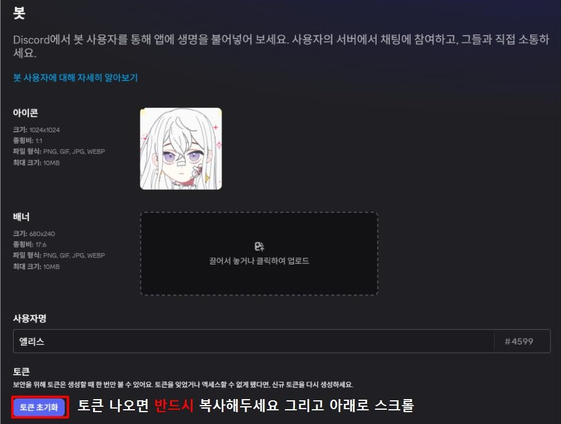

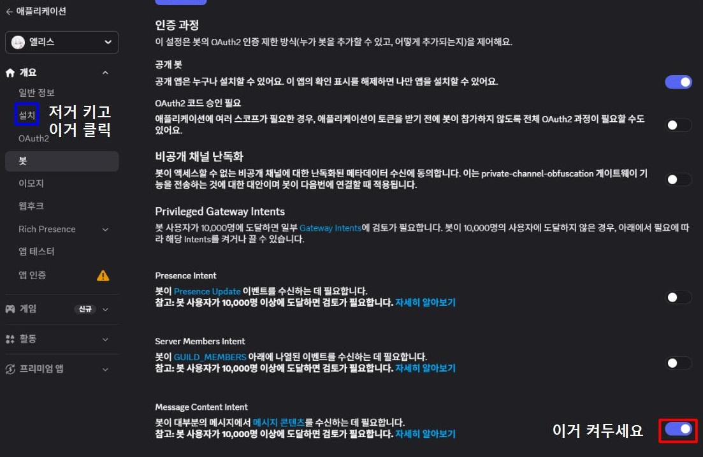

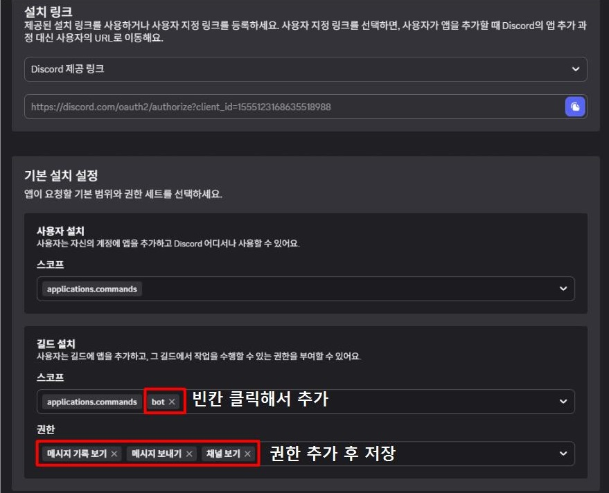

+ '채널 관리' 권한도 넣어주세요!

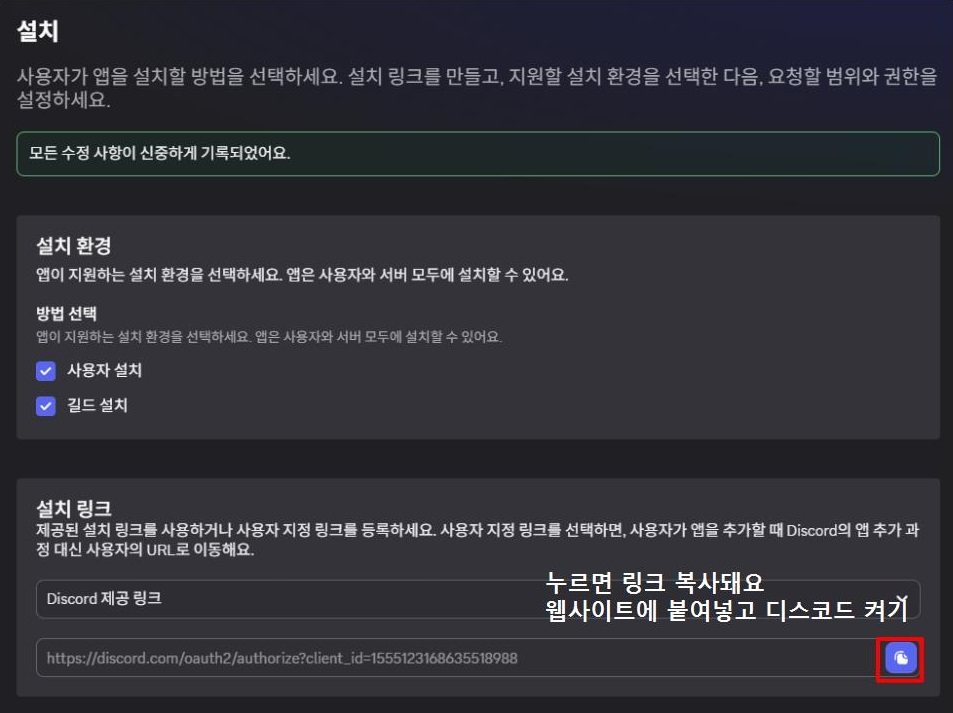

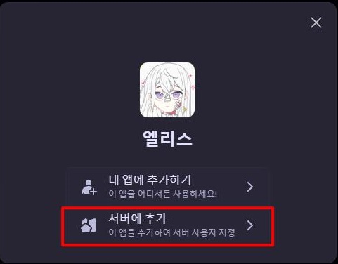

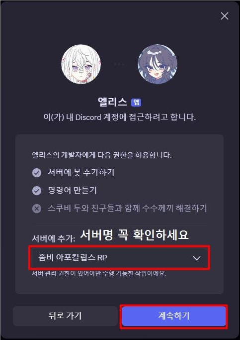

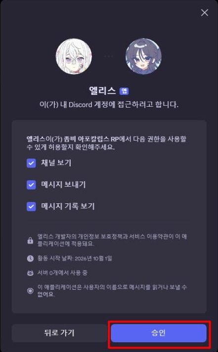

캐릭터 수만큼 (상태봇을 사용할 거라면 상태봇도) 생성해주시면 됩니다 

상태봇은 '링크 임베드' 권한을 추가로 넣어주셔야 합니다 

### 3. OpenAI API Key 준비

https://platform.openai.com/api-keys

GPT를 사용하기 때문에 이 프로그램의 설치와는 별도로 OpenAI API 사용료가 발생합니다. 

** Chat GPT PLUS 구독이 아닙니다!!** 

https://platform.openai.com/settings/organization/billing/overview

금액 충전은 여기서 하시면 되겠습니다. 

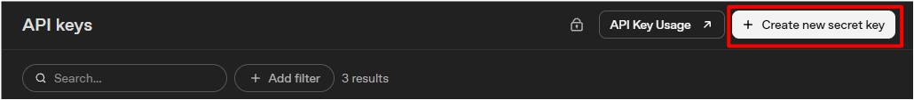

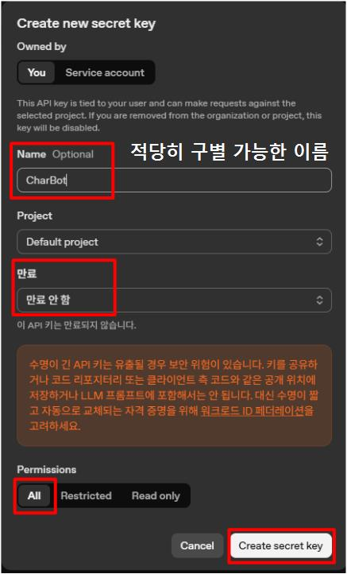

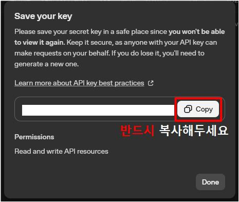

### 4. 최신 릴리즈 다운받기 
https://github.com/BS0817/generic-character-rp-bot/releases

Generic-Character-RP-Bot-Windows.zip <- 이거 다운받으시면 됩니다

압축을 풀어주세요

RPBot_Setup.exe 를 실행해주세요

### 5. 셋업 설정
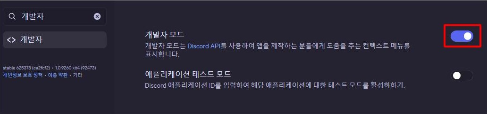

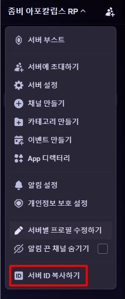

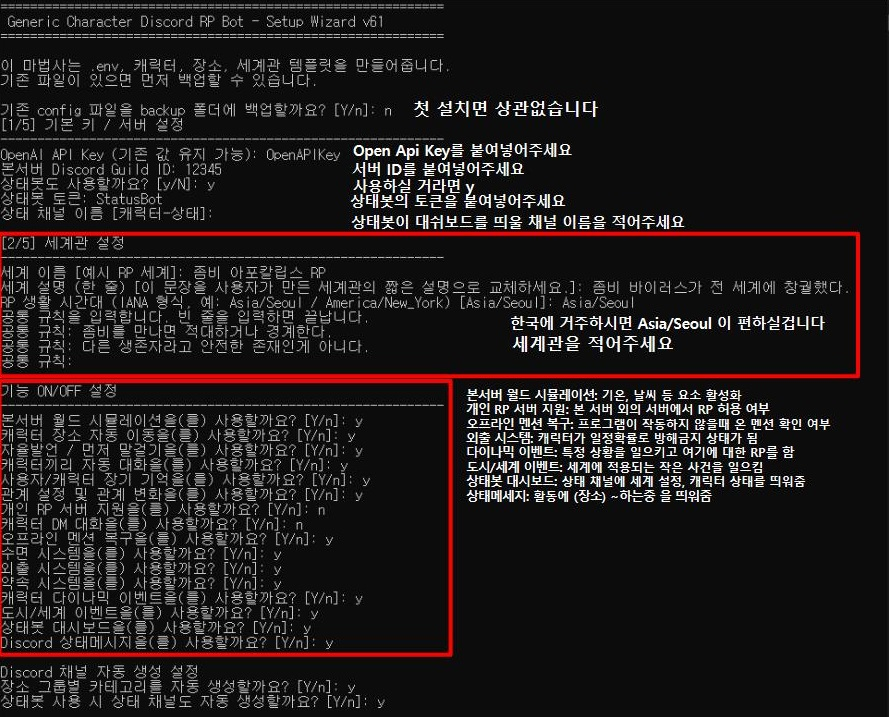

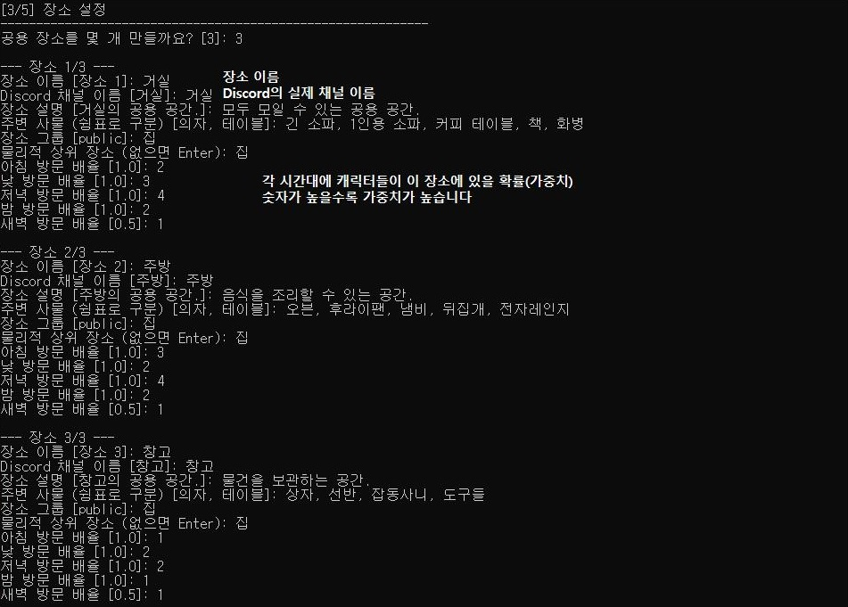

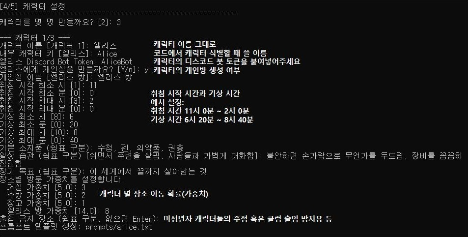

### 6. prompt 수정

Generic-Character-RP-Bot-Windows\prompts 로 들어갑니다 

각 캐릭터들의 설정에 맞게 템플릿으로 생성된 .txt 파일을 수정합니다

### 7. RPBot.exe 실행

간단합니다. RPBot.exe를 더블클릭해서 한 번 실행해 주세요 

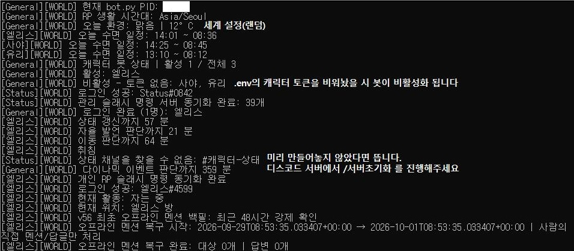

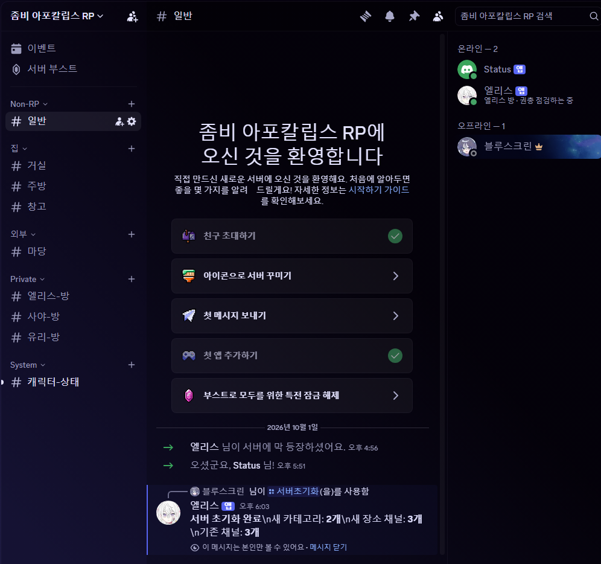

실행하고 나면 위와 같이 채널이 생성된 것을 볼 수 있습니다.

### 8. 테스트

캐릭터를 @멘션 하여 말을 걸어보고, 정상적으로 답하는지 보면 됩니다. 

그 이후엔 봇이 일정시간마다 자율 발언을 하고, 같은 장소에 있는 다른 캐릭터를 멘션하여 이야기를 시작할 수도 있습니다. 
